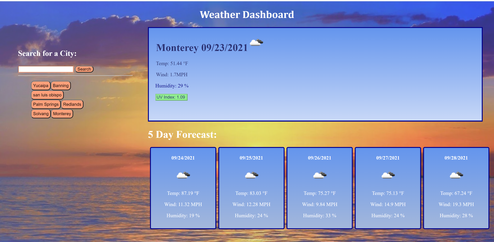

# Weather-Dashboard

## Description
This project is weather dashboard that allows you to see the weather of any city that the user searches.It keeps a history of what you've already searched and with that history you can click the city name and it will take you to the weather for that city. This site shows you the weather for the current day at the top along with the temperature, wind speed, an icon to show you the conditions, humidity and the uv index. The uv index shows you if the conditions are favorable, moderate or high risk based on the background color green, orange, yellow , or red. Below the current weather box it shows you the 5-day forecast, with the wind speed, humidity, an icon telling you the conditions, and temperature.

This project was very challenging and there was a lot of moving parts. For example I had to go to moment.js and format the date information taken from the weather api becuase it was in unix timecode which is unreadable to a user but using moment().unix().format converted it into a legible date.Then i had a lot of trouble extracting the exact information i wanted from the api and formating it on my page because there was more than one api call that needed to be made and  Javascript was used to dynamically create most of the elements on my page however through the use of a foreach loop the elemenets were able to keep going through a loop and creating each element until it got through all the data that was being called. Those were just some of the issues that came along the way but it taught me that I could do so much more with Javascript then I ever thought.

## Usage
To get started type in a city that you would like to find the weather for, then click search. After, the page will load the weather for the current day and the five day forecast. Now if you search up multiple cities and would like to go back to see what the weather again just press the name of the city and the fields will populate with the corresponding city you pressed.

[livesite](https://krcano.github.io/Weather-Dashboard/)

## MIT License

Copyright (c) [2021] [Kelly R. Cano]

Permission is hereby granted, free of charge, to any person obtaining a copy
of this software and associated documentation files (the "Software"), to deal
in the Software without restriction, including without limitation the rights
to use, copy, modify, merge, publish, distribute, sublicense, and/or sell
copies of the Software, and to permit persons to whom the Software is
furnished to do so, subject to the following conditions:

The above copyright notice and this permission notice shall be included in all
copies or substantial portions of the Software.

THE SOFTWARE IS PROVIDED "AS IS", WITHOUT WARRANTY OF ANY KIND, EXPRESS OR
IMPLIED, INCLUDING BUT NOT LIMITED TO THE WARRANTIES OF MERCHANTABILITY,
FITNESS FOR A PARTICULAR PURPOSE AND NONINFRINGEMENT. IN NO EVENT SHALL THE
AUTHORS OR COPYRIGHT HOLDERS BE LIABLE FOR ANY CLAIM, DAMAGES OR OTHER
LIABILITY, WHETHER IN AN ACTION OF CONTRACT, TORT OR OTHERWISE, ARISING FROM,
OUT OF OR IN CONNECTION WITH THE SOFTWARE OR THE USE OR OTHER DEALINGS IN THE
SOFTWARE.
